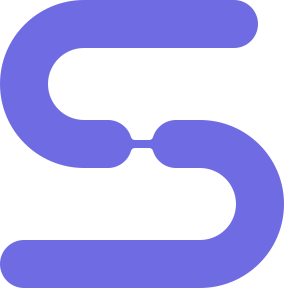
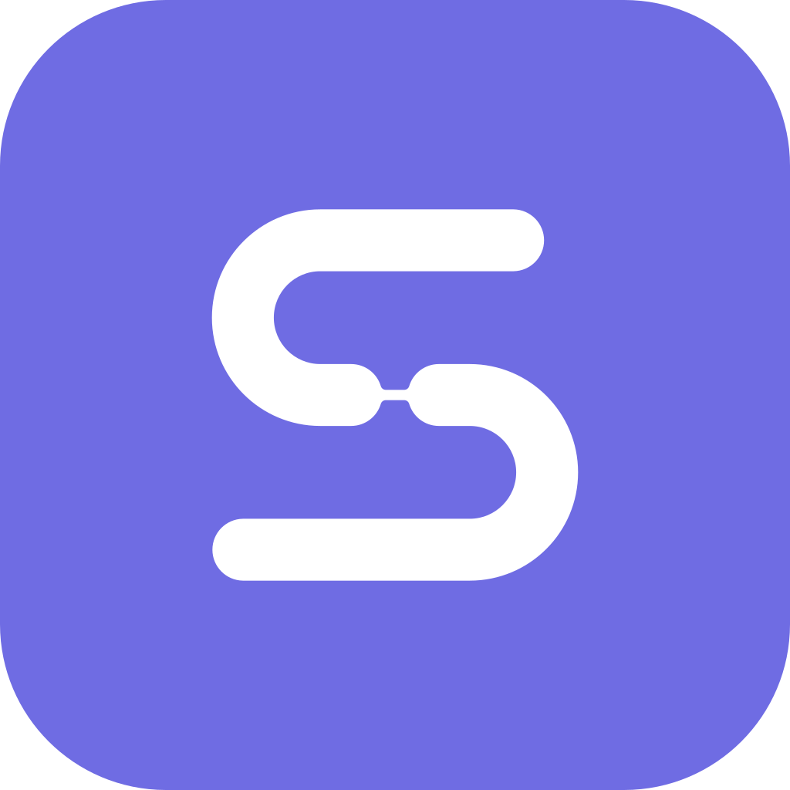
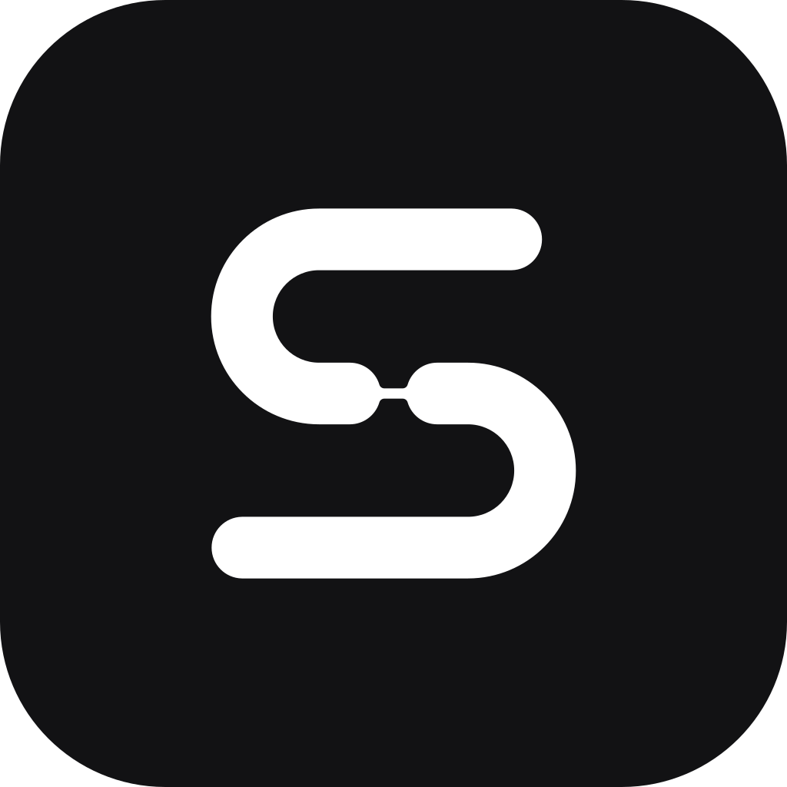

# Identidade visual — seeya

> Versão 1.0 · Setembro de 2026

## 1. Essência da marca

O seeya permite interromper o trabalho sem perder o fio: preserva contexto, decisões e próximos passos para que uma pessoa possa sair agora e retomar depois com segurança.

**Promessa central:** pause sem perder o contexto.

**Ideia orientadora:** _You can stop now without losing the thread._

### Atributos

- calmo, sem ser passivo;
- técnico, sem ser frio;
- confiável, sem ser burocrático;
- moderno, sem depender de clichês de IA;
- humano, respeitando os limites entre trabalho e descanso.

### Princípios visuais

1. **Continuidade:** elementos alinhados, fluxos claros e transições suaves.
2. **Pausa intencional:** respiro, espaços generosos e ausência de ruído.
3. **Precisão:** geometria simples, hierarquia forte e poucos elementos por tela.
4. **Preservação:** estados, checkpoints e histórico devem parecer seguros e recuperáveis.

---

## 2. Logo


### 2.1 Arquivos mestres

Todos os arquivos estão nesta pasta, em SVG com um único `<path>` preenchido por cor (sem traço,
sem transformação, sem fonte embutida) — abrem iguais em navegador, Figma e Illustrator.

| Arquivo                                  | Uso                                                             |
| ---------------------------------------- | --------------------------------------------------------------- |
| `seeya-logo.svg`                         | Assinatura principal: símbolo violeta, wordmark ink             |
| `seeya-logo-on-dark.svg`                 | Assinatura sobre fundo escuro: símbolo violeta, wordmark branco |
| `seeya-logo-black.svg`                   | Monocromático claro: tudo em ink                                |
| `seeya-logo-white.svg`                   | Monocromático escuro: tudo em branco                            |
| `seeya-symbol.svg` · `-black` · `-white` | Símbolo isolado nas três cores                                  |
| `seeya-wordmark.svg` · `-white`          | Wordmark isolado                                                |
| `seeya-app-icon.svg`                     | Ícone do aplicativo, fundo violeta                              |
| `seeya-app-icon-dark.svg`                | Ícone do aplicativo, fundo ink                                  |

|                              |                                 |                                           |
| :--------------------------: | :-----------------------------: | :---------------------------------------: |
|  |  |  |
|           símbolo            |            app icon             |               app icon dark               |

A arte de origem em raster fica fora do repositório: todo uso parte dos SVGs.

### 2.2 Símbolo

O símbolo é um `S` geométrico construído por dois percursos arredondados unidos por uma ponte central mais fina.

- Os percursos representam o fluxo de trabalho antes e depois da pausa.
- A ponte representa a preservação do contexto.
- A forma aberta e horizontal sugere continuidade, sem recorrer a setas, infinito ou ícones de sincronização.

O símbolo não deve ser reconstruído com uma fonte. Sempre deve ser utilizado a partir do arquivo mestre.

**Construção** (unidades do `viewBox` de `seeya-symbol.svg`, 284 × 288):

| Elemento                    | Medida                                                                                                                                                      |
| --------------------------- | ----------------------------------------------------------------------------------------------------------------------------------------------------------- |
| Espessura do percurso (`x`) | 48 — um sexto da altura do símbolo                                                                                                                          |
| Curvas                      | raio de centro 60 (interno 36, externo 84)                                                                                                                  |
| Terminais                   | meia-volta de raio 24                                                                                                                                       |
| Ponte                       | 8 de espessura, entre dois terminais redondos; concordâncias de raio 4                                                                                      |
| Assimetria                  | a barra superior termina 26 antes da borda direita; a inferior alinha com a borda esquerda. É intencional — vem da arte original e não deve ser "corrigida" |

### 2.3 Wordmark

O nome é apresentado em minúsculas: **seeya** — no logo e também em texto corrido, como no
README e no próprio comando.

O wordmark é uma composição tipográfica própria: os dois `e` compartilham uma única barra, que
nasce com terminal arredondado dentro do primeiro `e` e atravessa o segundo. Ele não deve ser
recriado digitando o nome em Geist ou outra fonte do produto.

O SVG foi vetorizado a partir da arte original em raster e reproduz a arte com 98,6% de sobreposição.
Em ampliações acima de ~4× as diagonais do `y` mostram ondulações mínimas herdadas do raster;
para impressão em grande formato, vale um acerto manual dessas retas.

### 2.4 Assinaturas

Usar três configurações oficiais:

1. **Horizontal:** símbolo à esquerda e wordmark à direita — assinatura principal.
2. **Símbolo isolado:** aplicativo, favicon, avatar, terminal e espaços compactos.
3. **Wordmark isolado:** situações em que o símbolo já esteja presente no contexto.

Proporções da assinatura horizontal, tomando `h` como a altura de x do wordmark (a altura das
minúsculas sem ascendente):

- altura do símbolo: `1.25h`;
- símbolo centralizado verticalmente na faixa da altura de x;
- distância entre símbolo e wordmark: `0.5h`.

### 2.5 Ícone do aplicativo

- quadrado de 1024 × 1024 com cantos de raio 215 (~21% do lado);
- símbolo branco com altura de 47% do lado, centralizado;
- fundo `brand-500` (padrão) ou `ink-950` (variante escura).

O ícone é o único contexto em que o símbolo vai dentro de um quadrado.

### 2.6 Pacote de ícones

Rasterizado da mesma geometria dos SVGs, em `icons/`:

| Arquivo                                 | Plataforma              | Conteúdo                                                          |
| --------------------------------------- | ----------------------- | ----------------------------------------------------------------- |
| `icon.ico`                              | Windows                 | 16, 24, 32, 48, 64, 128, 256 px                                   |
| `icon.icns`                             | macOS                   | 32 a 1024 px (inclui @2x)                                         |
| `icon.png` e `png/<n>x<n>.png`          | Linux e origem genérica | 16 a 1024 px, no formato de nomes que o `electron-builder` espera |
| `web/favicon.svg` · `web/favicon.ico`   | navegador               | símbolo isolado; `.ico` com 16, 32, 48 px                         |
| `web/apple-touch-icon.png`              | iOS                     | 180 px, quadrado opaco                                            |
| `web/icon-192.png` · `web/icon-512.png` | manifest web / Android  | quadrado opaco                                                    |

Três decisões por plataforma, todas derivadas das seções acima:

- **16 e 24 px usam o símbolo isolado, sem o quadrado** (no `.ico` e no favicon): com o quadrado,
  o `S` ficaria com 7–11 px (seção 2.8).
- **macOS segue a grade da Apple:** quadrado de 824 px, com raio 185, centralizado numa tela de
  1024 px transparente. Um ícone de borda a borda fica maior que os vizinhos no Dock.
- **iOS e Android recebem quadrado sem cantos arredondados:** o sistema aplica a própria
  máscara. O `S` com 47% do lado fica dentro da zona segura de ícone adaptável (círculo de 80%).

### 2.7 Área de proteção

Considere `x` como a espessura do percurso principal do símbolo (um sexto da altura dele).

- assinatura horizontal: mínimo de `1.5x` em todos os lados;
- símbolo isolado: mínimo de `1x` em todos os lados;
- nenhum texto, borda ou outro símbolo deve invadir essa área.

### 2.8 Tamanho mínimo

| Aplicação             | Mínimo recomendado |
| --------------------- | -----------------: |
| Símbolo digital       |    16 px de altura |
| App icon              |         32 × 32 px |
| Assinatura horizontal |  120 px de largura |
| Símbolo impresso      |    8 mm de largura |

Abaixo de ~32 px a ponte fica com menos de 1 px e passa a ser lida como um entalhe entre os dois
percursos. Isso é esperado e o símbolo continua reconhecível até 16 px — foi testado em 16, 20,
24, 32, 48 e 96 px. Versões com ponte engrossada foram testadas e ficaram **piores** (o entalhe
some e o `S` vira uma barra contínua), por isso não existe versão opticamente ajustada.

**Favicon:** usar o símbolo isolado, não o app icon. No app icon o símbolo ocupa 47% do lado —
num favicon de 16 px isso dá um `S` de 7 px.

### 2.9 Aplicação por fundo

| Fundo                | Símbolo     | Wordmark  | Arquivo                  |
| -------------------- | ----------- | --------- | ------------------------ |
| Claro                | `brand-500` | `ink-950` | `seeya-logo.svg`         |
| Escuro               | `brand-500` | `white`   | `seeya-logo-on-dark.svg` |
| Monocromático claro  | `ink-950`   | `ink-950` | `seeya-logo-black.svg`   |
| Monocromático escuro | `white`     | `white`   | `seeya-logo-white.svg`   |

O símbolo mantém a mesma cor nos dois temas: `brand-500` tem 4.56:1 sobre `#0D0D10` e 4.26:1
sobre branco, acima dos 3:1 exigidos para elementos gráficos. Sobre foto ou fundo colorido, usar
uma das versões monocromáticas.

### 2.10 Usos incorretos

Não:

- alterar proporções ou espessuras;
- remover, engrossar ou deslocar a ponte central;
- "corrigir" a assimetria das barras;
- aplicar contorno, sombra ou brilho;
- inclinar ou rotacionar;
- trocar o violeta por cores sem relação com a paleta;
- colocar o símbolo em um quadrado quando não se tratar do ícone do aplicativo;
- usar gradientes adicionais sobre a arte mestre;
- recriar o wordmark usando uma fonte comum;
- reduzir o contraste a ponto de prejudicar a leitura.

---

## 3. Paleta de cores

### 3.1 Cores principais

| Token         | Hex       | RGB             | Uso                                                       |
| ------------- | --------- | --------------- | --------------------------------------------------------- |
| `brand-500`   | `#6F6CE3` | `111, 108, 227` | **Cor do logo.** Medida na arte mestre; não muda por tema |
| `brand-600`   | `#615EF5` | `97, 94, 245`   | Primária de interface: botões e destaques                 |
| `ink-950`     | `#121214` | `18, 18, 20`    | Wordmark e texto principal                                |
| `white`       | `#FFFFFF` | `255, 255, 255` | Superfícies e aplicação reversa                           |
| `canvas-warm` | `#F6F6F4` | `246, 246, 244` | Fundo institucional claro (o da folha de proposta)        |

**Por que o logo e a interface usam violetas diferentes.** A cor do logo tem 4.26:1 sobre branco:
suficiente para o logo (elemento gráfico, mínimo 3:1), insuficiente para texto pequeno (mínimo
4.5:1). `brand-600` é um degrau mais escuro e mais saturado da mesma família, com 4.74:1 sobre
branco — e branco sobre ele também dá 4.74:1, o que serve para botão. Nunca use `brand-600` no
logo, nem `brand-500` em texto pequeno.

### 3.2 Escala violeta

| Token       | Hex       | Uso recomendado                                          |
| ----------- | --------- | -------------------------------------------------------- |
| `brand-50`  | `#F5F4FF` | Fundo sutil                                              |
| `brand-100` | `#ECEAFF` | Seleção e destaque discreto                              |
| `brand-200` | `#D9D5FF` | Bordas destacadas                                        |
| `brand-300` | `#BDB6FF` | Elementos decorativos                                    |
| `brand-400` | `#9389FB` | Estado dark secundário                                   |
| `brand-500` | `#6F6CE3` | Logo                                                     |
| `brand-600` | `#615EF5` | Primária de interface                                    |
| `brand-700` | `#4F46D8` | Hover e pressed no tema claro; texto violeta sobre claro |
| `brand-800` | `#413AAD` | Ênfase sobre fundo claro                                 |
| `brand-900` | `#342F82` | Ênfase escura                                            |
| `brand-950` | `#1F1B4D` | Fundo violeta profundo                                   |

### 3.3 Escala neutra

A escala é levemente fria para harmonizar com o violeta sem produzir um aspecto azulado excessivo.

| Token          | Hex       | Uso recomendado                               |
| -------------- | --------- | --------------------------------------------- |
| `neutral-0`    | `#FFFFFF` | Superfície elevada clara                      |
| `neutral-25`   | `#FCFCFD` | Canvas claro                                  |
| `neutral-50`   | `#F7F7F8` | Superfície secundária                         |
| `neutral-100`  | `#EFEFF1` | Hover suave                                   |
| `neutral-200`  | `#DDDDE1` | Bordas claras (decorativas)                   |
| `neutral-300`  | `#C7C7CD` | Controles desabilitados                       |
| `neutral-400`  | `#9D9DA7` | Placeholder                                   |
| `neutral-500`  | `#747480` | Texto terciário; borda de campo de formulário |
| `neutral-600`  | `#565661` | Texto secundário claro                        |
| `neutral-700`  | `#3C3C45` | Bordas escuras                                |
| `neutral-800`  | `#27272E` | Superfície dark elevada                       |
| `neutral-900`  | `#18181D` | Superfície dark                               |
| `neutral-950`  | `#121214` | Ink / wordmark                                |
| `neutral-1000` | `#000000` | Uso excepcional                               |

Evitar preto puro em grandes superfícies. `neutral-950` mantém profundidade com menor agressividade visual.

`neutral-400` tem 2.69:1 sobre branco: serve para placeholder só enquanto o placeholder for dica,
nunca a única indicação do que o campo pede.

### 3.4 Cores semânticas

A cor base serve para ícone, borda e preenchimento. **Como texto, a base não passa no AA sobre
fundo claro** (atenção: 2.76:1 sobre branco; sucesso: 3.24:1) — use a coluna de texto.

| Papel      | Base      | Fundo claro | Texto sobre claro | Fundo dark | Texto sobre dark |
| ---------- | --------- | ----------- | ----------------- | ---------- | ---------------- |
| Sucesso    | `#16A36A` | `#EAF8F1`   | `#028051`         | `#102B21`  | `#16A36A`        |
| Informação | `#3578E5` | `#EDF4FF`   | `#286BD7`         | `#13243D`  | `#4588F6`        |
| Atenção    | `#D98A17` | `#FFF6E5`   | `#A16400`         | `#33240E`  | `#D98A17`        |
| Erro       | `#DC4C4C` | `#FFF0F0`   | `#CA3B3E`         | `#351717`  | `#E65554`        |

As cores de texto mantêm matiz e saturação da base e só mudam a luminosidade, até passar de 4.5:1
tanto sobre o fundo do próprio papel quanto sobre `surface` (branco no claro, `#18181D` no dark).

Atenção como ícone ou borda sobre branco também fica abaixo dos 3:1 exigidos para componente
gráfico; nesses casos, use `#A16400`.

As cores semânticas não substituem o violeta da marca. Devem ser usadas apenas para comunicar estado.

---

## 4. Tipografia

### 4.1 Família principal

**Geist Sans** é a fonte recomendada para interface, site e documentação. Licença SIL Open Font
License — pode ser distribuída junto com o aplicativo.

Fallback:

```css
font-family:
  'Geist',
  'Inter',
  ui-sans-serif,
  system-ui,
  -apple-system,
  BlinkMacSystemFont,
  'Segoe UI',
  sans-serif;
```

### 4.2 Família monoespaçada

**Geist Mono** deve ser usada em comandos, caminhos, atalhos, logs, IDs e trechos técnicos.

```css
font-family: 'Geist Mono', 'SFMono-Regular', Consolas, 'Liberation Mono', monospace;
```

**Exceção: o terminal embutido.** As abas continuam com a fonte da configuração
`terminalFontFamily`, cujo padrão termina numa Nerd Font embutida — os prompts de shell usam
glifos que a Geist Mono não tem. A Geist Mono vale para o texto técnico fora do terminal.

### 4.3 Pesos

| Peso | Uso                                                |
| ---: | -------------------------------------------------- |
|  400 | Corpo, descrições e labels extensos                |
|  500 | Controles, navegação e metadados importantes       |
|  600 | Títulos de seção e ações principais                |
|  700 | Headline e números de destaque; usar com moderação |

### 4.4 Escala tipográfica

Base de `16 px`, proporção aproximada de `1.2` e line-height confortável.

| Token       | Tamanho / linha | Peso | Uso                             |
| ----------- | --------------- | ---: | ------------------------------- |
| `display`   | `48 / 52 px`    |  600 | Hero e mensagens institucionais |
| `heading-1` | `36 / 42 px`    |  600 | Título principal                |
| `heading-2` | `30 / 36 px`    |  600 | Seções principais               |
| `heading-3` | `24 / 30 px`    |  600 | Cards e subseções               |
| `heading-4` | `20 / 26 px`    |  600 | Blocos compactos                |
| `body-lg`   | `18 / 28 px`    |  400 | Introduções                     |
| `body-md`   | `16 / 24 px`    |  400 | Corpo padrão                    |
| `body-sm`   | `14 / 20 px`    |  400 | Metadados e suporte             |
| `caption`   | `12 / 16 px`    |  500 | Labels e timestamps             |
| `code`      | `13 / 20 px`    |  400 | Terminal e conteúdo técnico     |

Não usar caixa alta em títulos ou parágrafos. Caixa alta é permitida apenas em labels muito curtos, com tracking entre `0.08em` e `0.12em`.

---

## 5. Temas

### 5.1 Tema claro

| Token semântico  | Valor                     |
| ---------------- | ------------------------- |
| `background`     | `#FCFCFD`                 |
| `surface`        | `#FFFFFF`                 |
| `surface-subtle` | `#F7F7F8`                 |
| `surface-hover`  | `#EFEFF1`                 |
| `text-primary`   | `#121214`                 |
| `text-secondary` | `#565661`                 |
| `text-tertiary`  | `#747480`                 |
| `border`         | `#DDDDE1`                 |
| `border-strong`  | `#C7C7CD`                 |
| `border-control` | `#747480`                 |
| `primary`        | `#615EF5`                 |
| `primary-hover`  | `#4F46D8`                 |
| `primary-active` | `#413AAD`                 |
| `primary-soft`   | `#ECEAFF`                 |
| `primary-text`   | `#4F46D8`                 |
| `on-primary`     | `#FFFFFF`                 |
| `focus-ring`     | `rgba(97, 94, 245, 0.35)` |
| `overlay`        | `rgba(18, 18, 20, 0.55)`  |

### 5.2 Tema escuro

O tema dark não é uma inversão literal. Superfícies elevadas ficam progressivamente mais claras e o violeta recebe luminosidade adicional.

| Token semântico    | Valor                       |
| ------------------ | --------------------------- |
| `background`       | `#0D0D10`                   |
| `surface`          | `#18181D`                   |
| `surface-subtle`   | `#202026`                   |
| `surface-elevated` | `#27272E`                   |
| `surface-hover`    | `#303038`                   |
| `text-primary`     | `#F7F7F8`                   |
| `text-secondary`   | `#A6A6B0`                   |
| `text-tertiary`    | `#81818C`                   |
| `border`           | `#303038`                   |
| `border-strong`    | `#45454F`                   |
| `border-control`   | `#747480`                   |
| `primary`          | `#817CF8`                   |
| `primary-hover`    | `#9389FB`                   |
| `primary-active`   | `#A7A3FF`                   |
| `primary-soft`     | `#25214E`                   |
| `primary-text`     | `#A7A3FF`                   |
| `on-primary`       | `#121214`                   |
| `focus-ring`       | `rgba(147, 137, 251, 0.45)` |
| `overlay`          | `rgba(0, 0, 0, 0.72)`       |

### 5.3 Regras de contraste dos temas

Medidas contra os valores acima; valem até alguém mudar um token.

- **Texto sobre o botão primário:** `on-primary`. No claro, branco sobre `#615EF5` dá 4.74:1.
  No dark, **branco sobre `#817CF8` dá só 3.40:1** — o texto do botão é `#121214` (5.50:1).
- **Violeta como texto (link, destaque):** `primary-text`, não `primary`. No claro, `#615EF5` cai
  para 4.43:1 em `surface-subtle` e 4.13:1 em `surface-hover`; `#4F46D8` passa de 5.7:1 em todas
  as superfícies. No dark, `#817CF8` cai para 3.84:1 em `surface-hover`; `#A7A3FF` passa de
  5.8:1 em todas.
- **`text-tertiary` só sobre `background` e `surface`.** Nas superfícies mais escuras (claro) ou
  mais claras (dark) ele fica abaixo de 4.5:1 — ali, use `text-secondary`.
- **Borda de campo de formulário:** `border-control`. `border` e `border-strong` ficam entre 1.0:1
  e 2.1:1 — bons para separar blocos, insuficientes para identificar um campo (mínimo 3:1).
  `#747480` passa de 3:1 em todas as superfícies dos dois temas.

### 5.4 Tokens CSS de referência

```css
:root {
  color-scheme: light;

  --seeya-logo: #6f6ce3;

  --seeya-brand: #615ef5;
  --seeya-brand-hover: #4f46d8;
  --seeya-brand-active: #413aad;
  --seeya-brand-soft: #eceaff;
  --seeya-brand-text: #4f46d8;
  --seeya-on-brand: #ffffff;

  --seeya-background: #fcfcfd;
  --seeya-surface: #ffffff;
  --seeya-surface-subtle: #f7f7f8;
  --seeya-surface-hover: #efeff1;

  --seeya-text: #121214;
  --seeya-text-secondary: #565661;
  --seeya-text-tertiary: #747480;

  --seeya-border: #dddde1;
  --seeya-border-strong: #c7c7cd;
  --seeya-border-control: #747480;
  --seeya-focus-ring: rgb(97 94 245 / 35%);
  --seeya-overlay: rgb(18 18 20 / 55%);
}

[data-theme='dark'] {
  color-scheme: dark;

  --seeya-brand: #817cf8;
  --seeya-brand-hover: #9389fb;
  --seeya-brand-active: #a7a3ff;
  --seeya-brand-soft: #25214e;
  --seeya-brand-text: #a7a3ff;
  --seeya-on-brand: #121214;

  --seeya-background: #0d0d10;
  --seeya-surface: #18181d;
  --seeya-surface-subtle: #202026;
  --seeya-surface-hover: #303038;

  --seeya-text: #f7f7f8;
  --seeya-text-secondary: #a6a6b0;
  --seeya-text-tertiary: #81818c;

  --seeya-border: #303038;
  --seeya-border-strong: #45454f;
  --seeya-border-control: #747480;
  --seeya-focus-ring: rgb(147 137 251 / 45%);
  --seeya-overlay: rgb(0 0 0 / 72%);
}
```

`--seeya-logo` não é redefinido no dark: o símbolo tem a mesma cor nos dois temas (seção 2.9).

---

## 6. Interface e composição

### 6.1 Espaçamento

Usar uma grade baseada em `4 px`:

```text
4 · 8 · 12 · 16 · 24 · 32 · 48 · 64 · 96
```

Priorizar espaços de `16`, `24` e `32 px`. O seeya deve transmitir controle e calma; telas excessivamente densas contradizem a marca.

### 6.2 Raios

| Token         |     Valor | Uso                         |
| ------------- | --------: | --------------------------- |
| `radius-sm`   |    `6 px` | Inputs e elementos pequenos |
| `radius-md`   |   `10 px` | Botões e cards compactos    |
| `radius-lg`   |   `14 px` | Cards principais e dialogs  |
| `radius-xl`   |   `20 px` | Painéis de destaque         |
| `radius-full` | `9999 px` | Chips e indicadores         |

Os raios acompanham a construção arredondada do símbolo, mas não devem tornar toda a interface excessivamente “fofa”.

### 6.3 Bordas e sombras

- Preferir bordas de `1 px` e diferença de superfície.
- Usar sombras apenas para sobreposição real: menus, popovers e modais.
- Evitar glow violeta permanente.

```css
--shadow-popover: 0 12px 32px rgb(18 18 20 / 12%);
--shadow-dialog: 0 24px 64px rgb(18 18 20 / 18%);
```

No tema dark, reduzir sombras e reforçar bordas.

### 6.4 Ícones

- traço arredondado entre `1.5` e `2 px`;
- grade preferencial de `20` ou `24 px`;
- linguagem simples e geométrica;
- evitar ícones preenchidos misturados com ícones outline;
- não usar sparkles para representar IA de forma genérica.

### 6.5 Movimento

O movimento deve reforçar continuidade e retomada:

- microinterações: `120–180 ms`;
- transições de painel: `180–240 ms`;
- easing recomendado: `cubic-bezier(0.2, 0.8, 0.2, 1)`;
- respeitar `prefers-reduced-motion`;
- evitar animações infinitas fora de estados reais de processamento.

Uma animação institucional possível faz a ponte central do símbolo aparecer suavemente, conectando os dois percursos. Ela deve ocorrer uma única vez e durar no máximo `600 ms`. O símbolo mestre é um único contorno; a animação precisa de uma versão com os dois percursos e a ponte como formas separadas, derivada da mesma construção (seção 2.2).

---

## 7. Linguagem da marca

### Tom

O seeya fala como um colega experiente que mantém o trabalho organizado e permite que a pessoa se desligue com tranquilidade.

- direto e calmo;
- seguro, sem prometer infalibilidade;
- técnico quando necessário;
- sem entusiasmo artificial;
- sem tratar sobrecarga como produtividade.

### Exemplos

| Evitar                          | Preferir                                    |
| ------------------------------- | ------------------------------------------- |
| “Sua produtividade nunca para.” | “Seu contexto fica. Você pode parar.”       |
| “A IA que trabalha por você.”   | “Retome com o contexto que já construiu.”   |
| “Finalize tudo antes de sair.”  | “Registre o ponto atual e continue depois.” |
| “10× mais produtivo.”           | “Menos esforço para reencontrar o fio.”     |

### Vocabulário central

`pause` · `preserve` · `resume` · `context` · `thread` · `continuity`

**Na interface e na documentação, os nomes são os do produto**, não os da campanha: _end day_,
_start day_, _handoff_, _briefing_, _snooze_, _skip today_ — os mesmos do CLI e do glossário do
projeto. `thread` e `continuity` são metáfora de marca (slogan, site, apresentação), não rótulo de
botão. `checkpoint` não é um conceito do produto e não deve aparecer como se fosse.

---

## 8. Acessibilidade

- Almejar WCAG 2.2 AA em toda interface.
- Texto normal: contraste mínimo de `4.5:1`.
- Texto grande e componentes gráficos essenciais: mínimo de `3:1`.
- Foco sempre visível; nunca depender apenas de mudança de cor.
- Estados devem combinar cor, texto e/ou ícone.
- Áreas interativas devem possuir pelo menos `44 × 44 px` quando usadas por toque.
- Animações não devem ser essenciais para compreender o estado.

Os números de contraste deste documento foram calculados pela fórmula de luminância relativa do
WCAG sobre os hex listados. O contraste deve ser validado novamente sempre que uma cor for
aplicada sobre fundos diferentes dos definidos aqui.

---

## 9. Resumo de implementação

| Elemento              | Decisão oficial                                                                           |
| --------------------- | ----------------------------------------------------------------------------------------- |
| Nome                  | `seeya` em minúsculas, também em texto corrido                                            |
| Símbolo               | `S` de dois percursos conectados; arquivos mestres nesta pasta                            |
| Cor do logo           | `#6F6CE3`, igual nos dois temas                                                           |
| Primária de interface | `#615EF5` (claro) · `#817CF8` (dark)                                                      |
| Ink                   | `#121214`                                                                                 |
| Fonte de interface    | Geist Sans                                                                                |
| Fonte técnica         | Geist Mono (o terminal embutido mantém a Nerd Font)                                       |
| Tema claro            | Neutros claros com violeta principal                                                      |
| Tema dark             | Fundo `#0D0D10`, superfícies em camadas, violeta clareado, texto escuro no botão primário |
| Estilo                | Minimalista, preciso, calmo e humano                                                      |
| Ideia                 | Parar sem perder o fio                                                                    |

Este documento é a referência principal para novas interfaces, materiais institucionais, documentação e integrações do seeya.
